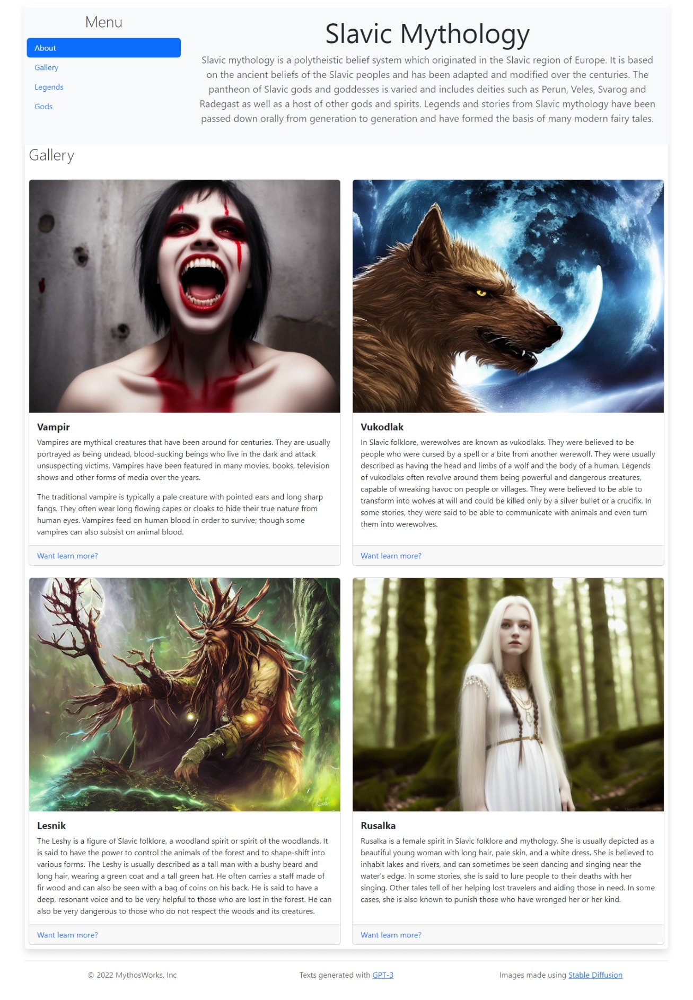

# Vícesloupcový layout pomocí Bootstrap 5

## Zadání

Vytvořte stránku zachycenou na následujícím screenshotu pomocí Bootstrap 5.

## Celkový pohled

## Zdroje informací

* https://getbootstrap.com/docs/5.3/layout/containers/
* https://getbootstrap.com/docs/5.3/layout/grid/
* https://getbootstrap.com/docs/5.3/layout/columns/

## Komponenty

* https://getbootstrap.com/docs/5.3/components/navs-tabs/
* https://getbootstrap.com/docs/5.3/components/card/

## Texty

Slavic Mythology

Slavic mythology is a polytheistic belief system which originated in the Slavic region of Europe. It is based on the ancient beliefs of the Slavic peoples and has been adapted and modified over the centuries. The pantheon of Slavic gods and goddesses is varied and includes deities such as Perun, Veles, Svarog and Radegast as well as a host of other gods and spirits. Legends and stories from Slavic mythology have been passed down orally from generation to generation and have formed the basis of many modern fairy tales.

Vampir

Vampires are mythical creatures that have been around for centuries. They are usually portrayed as being undead, blood-sucking beings who live in the dark and attack unsuspecting victims. Vampires have been featured in many movies, books, television shows and other forms of media over the years.

The traditional vampire is typically a pale creature with pointed ears and long sharp fangs. They often wear long flowing capes or cloaks to hide their true nature from human eyes. Vampires feed on human blood in order to survive; though some vampires can also subsist on animal blood.

Vukodlak

In Slavic folklore, werewolves are known as vukodlaks. They were believed to be people who were cursed by a spell or a bite from another werewolf. They were usually described as having the head and limbs of a wolf and the body of a human. Legends of vukodlaks often revolve around them being powerful and dangerous creatures, capable of wreaking havoc on people or villages. They were believed to be able to transform into wolves at will and could be killed only by a silver bullet or a crucifix. In some stories, they were said to be able to communicate with animals and even turn them into werewolves.

Lesnik

The Leshy is a figure of Slavic folklore, a woodland spirit or spirit of the woodlands. It is said to have the power to control the animals of the forest and to shape-shift into various forms. The Leshy is usually described as a tall man with a bushy beard and long hair, wearing a green coat and a tall green hat. He often carries a staff made of fir wood and can also be seen with a bag of coins on his back. He is said to have a deep, resonant voice and to be very helpful to those who are lost in the forest. He can also be very dangerous to those who do not respect the woods and its creatures.

Rusalka

Rusalka is a female spirit in Slavic folklore and mythology. She is usually depicted as a beautiful young woman with long hair, pale skin, and a white dress. She is believed to inhabit lakes and rivers, and can sometimes be seen dancing and singing near the water's edge. In some stories, she is said to lure people to their deaths with her singing. Other tales tell of her helping lost travelers and aiding those in need. In some cases, she is also known to punish those who have wronged her or her kind.

    © 2022 MythosWorks, Inc

    Texts generated with <a href="https://platform.openai.com/playground">GPT-3</a>

    Images made using <a href="https://huggingface.co/spaces/stabilityai/stable-diffusion">Stable Diffusion</a>

## Šířky sloupců

